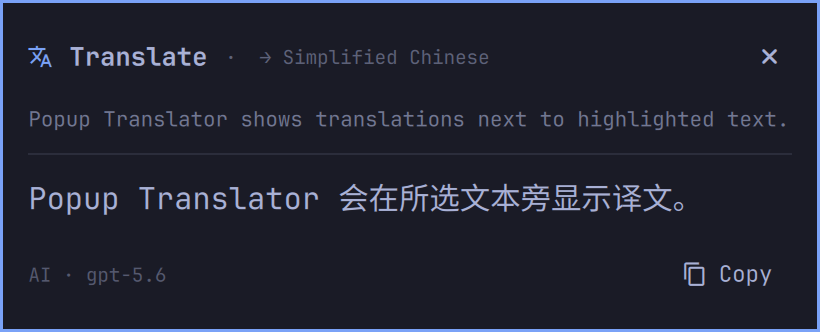

# Popup Translator

Translate highlighted text from Wayland apps in a compact Omarchy popup.



## Install

```bash
omarchy plugin add https://github.com/legibet/omarchy-popup-translator.git --enable
```

Bing is the default provider. Install `translate-shell` before using it:

```bash
omarchy pkg add translate-shell
```

Add a shortcut to `~/.config/hypr/bindings.lua`:

```lua
local plugin_dir = os.getenv("HOME") .. "/.config/omarchy/plugins/io.github.legibet.popup-translator"
o.bind("SUPER + ALT + D", "Translate highlighted text", plugin_dir .. "/bin/popup-translator")
```

The shortcut reads the Wayland primary selection, so the current application must expose highlighted text there.

## Settings

Click the translation icon in the top bar to choose Chinese, English, Japanese, Korean, French, German, or Spanish as the target language. You can use Bing or a streaming OpenAI-compatible provider.

AI endpoints must support streaming Chat Completions at `<base-url>/chat/completions`. The official OpenAI endpoint can read `OPENAI_API_KEY` from the Omarchy Shell environment. Keys entered in the panel are stored at `~/.config/omarchy-popup-translator/api-key` with mode `0600`.

## Remove

Remove the shortcut from `~/.config/hypr/bindings.lua`, then remove the plugin:

```bash
omarchy plugin remove io.github.legibet.popup-translator
```

Delete the stored API key separately if you created one:

```bash
rm -f ~/.config/omarchy-popup-translator/api-key
```
